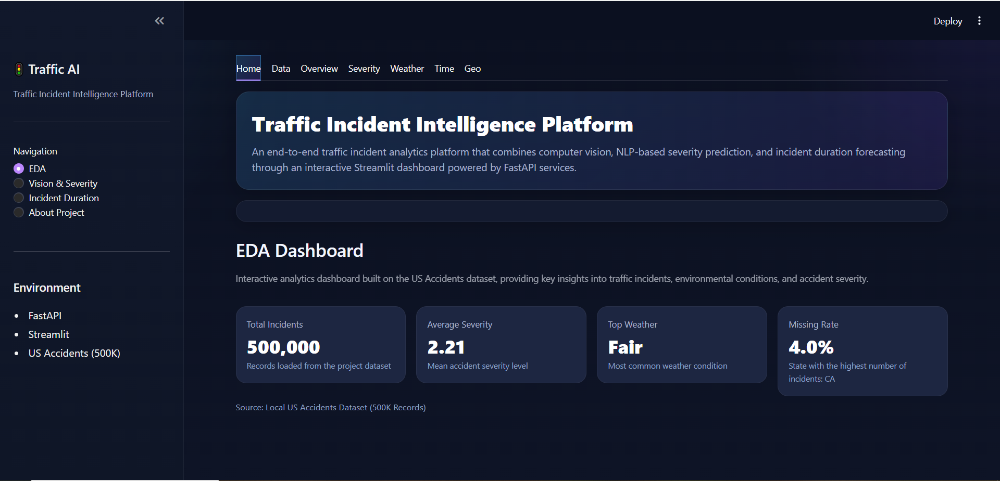
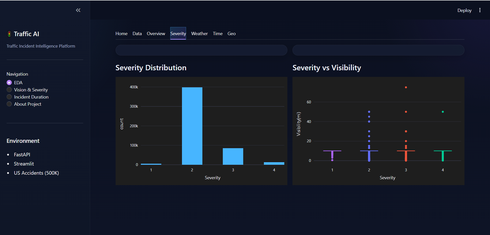
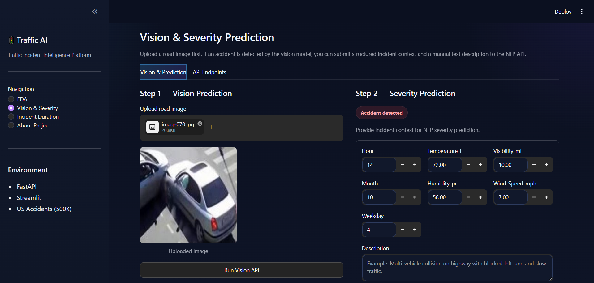
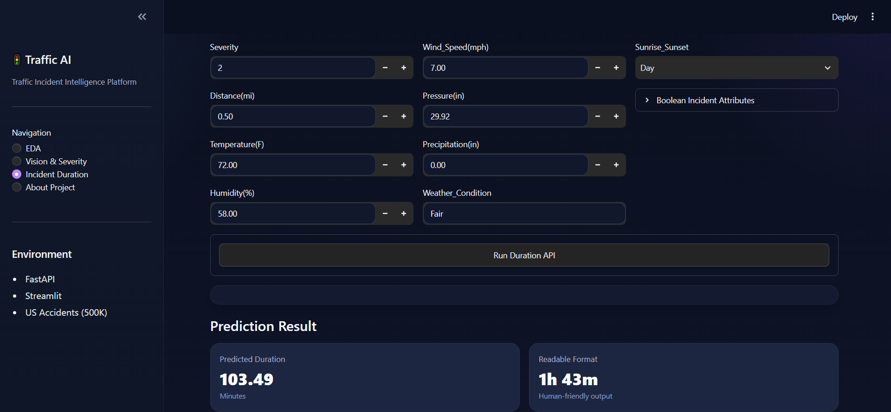
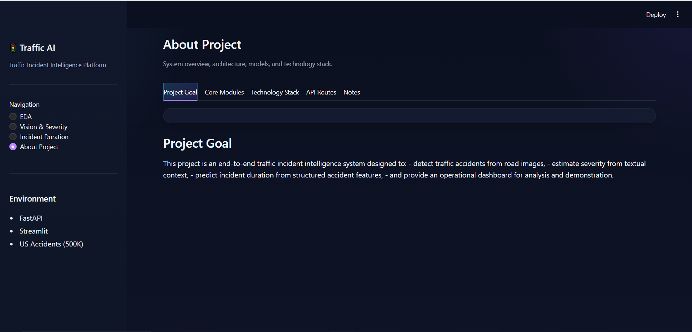

# 🚦 Traffic AI System

A self-contained Streamlit application for traffic accident analysis and AI-based prediction using Computer Vision, NLP, and Machine Learning models.

## 📌 Features

- Traffic accident EDA and visualization
- Accident severity prediction using NLP
- Incident duration prediction using ML
- Traffic image classification using CNN
- Local AI model inference inside Streamlit
- Model status monitoring

## 📸 Dashboard Preview

### 🏠 Home Page

Overview of the Traffic AI System, including project introduction, main features, and quick access to accident analysis and AI prediction modules.




### 📊 Exploratory Data Analysis

Interactive analysis of traffic accident patterns, severity distribution, weather conditions, and time-based trends.



### 🖼️ Traffic Image Classification

CNN-based image classification for detecting traffic accident-related images.




### ⏱️ Incident Duration Prediction

Machine learning model for predicting traffic incident duration based on accident features.



## 🎯 Project Goal

The goal of this project is to analyze traffic accident data and provide AI-based prediction modules for accident severity, incident duration, and traffic image classification.




## 🤖 Machine Learning

### Models

- CNN model for traffic image classification
- NLP model for accident severity prediction
- ML regression/classification pipeline for incident duration prediction

### Classes / Outputs

- Accident / Natural image classification
- Accident severity prediction
- Incident duration estimation

## 🛠 Tech Stack

Python • Streamlit • Pandas • NumPy • Plotly • Scikit-learn • XGBoost • TensorFlow/Keras • Joblib

## ▶️ Run Locally
```bash
pip install -r requirements.txt
streamlit run frontend/app.py
